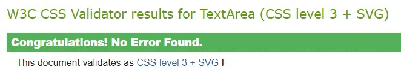
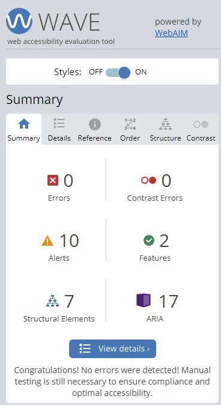
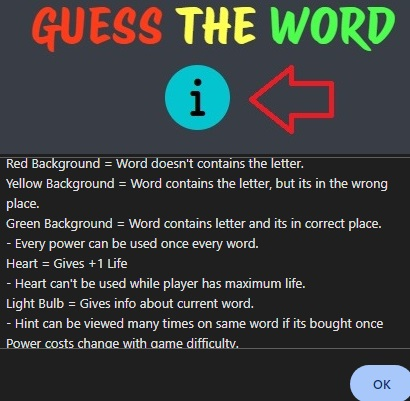
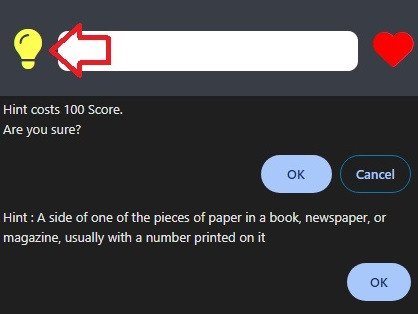

# Guess The Word

(Developed by Oğuzhan Akça)

[Live webpage](https://oguzhanakca.github.io/pp2-guess-the-word/)

## Table of Content

1. [Project Goals](#project-goals)
   1. [User Goals](#user-goals)
   2. [Site Owner Goals](#site-owner-goals)
2. [User Experience](#user-experience)
   1. [Target Audience](#target-audience)
   2. [User Requrements and Expectations](#user-requrements-and-expectations)
   3. [User Stories](#user-stories)
3. [Design](#design)
   1. [Design Choices](#design-choices)
   2. [Colour](#colours)
   3. [Fonts](#fonts)
   4. [Structure](#structure)
   5. [Wireframes](#wireframes)
4. [Technologies Used](#technologies-used)
   1. [Languages](#languages)
   2. [Frameworks & Tools](#frameworks-&-tools)
5. [Features](#features)
6. [Testing](#validation)
   1. [HTML Validation](#HTML-validation)
   2. [CSS Validation](#CSS-validation)
   3. [Accessibility](#accessibility)
   4. [Performance](#performance)
   5. [Device testing](#performing-tests-on-various-devices)
   6. [Browser compatibility](#browser-compatability)
   7. [Testing user stories](#testing-user-stories)
7. [Bugs](#Bugs)
8. [Deployment](#deployment)
9. [Credits](#credits)
10. [Acknowledgements](#acknowledgements)

## Project Goals

Guess The Word is a challenging game for people who wanna test their knowledge of words.

### User Goals

- Playing a challenging word guessing game
- Having fun while spending time

### Site Owner Goals

- Create a challenging game
- Give players more chances incase they need
- Game should be playable on different devices

## User Experience

### Target Audience

- People who wants to play a challenging game and have fun
- People who wants to test their knowledge

### User Requirements and Expectations

- Accessibility
- Easy and challenging to play
- Eye-friendly UI Design
- Learning how to play
- Easy to give feedback
- Replayability

### User Stories

#### First-time User

As a first time user,

1. I want to be able to choose game difficulty
2. I want to know how to play
3. I want to have additional hints & lifes
4. I want to find social media accounts
5. I want to leave feedback
6. I want to see my life & score
7. I want to see the cost of powers
8. I want to see the history of my guesses

#### Returning User

As a returning user,

9. I want to be able to choose game difficulty
10. I want to remember how to play
11. I want to find social media accounts
12. I want to give feedback
13. I want to see my life & score

#### Site Owner

As the site owner,

14. I want users to be able to find our social media accounts
15. I want users to be able to find how to play
16. I want users to be able to give feedback
17. I want users to see their current stats
18. I want users to choose their desired difficulty
19. I want users to be able to go back to Homepage when they are in wrong page

## Design

### Design Choices

The game is designed with an interface that will not hurt user's eyes. Also with the difficulty levels, it's aimed for the users to test themselves while having fun.

### Colour

Dark and soft colors was chosen to keep eye-friendly design. Also users can get clear info about their guesses.
 

### Fonts

Game title : Protest Riot
 
Difficulty options : Permanent Marker
 
Main Font : Oswald

### Structure

The page is structured in a user and eye-friendly way. It's easy to learn and engage. The website consists of three separate pages:

- A homepage with 5 different views:
  - Game Difficulty Screen
  - Gameplay Screen
  - Correct Answer Screen
  - Wrong Answer Screen
  - End Game Screen
- A Contact Page with 2 different views
  - Contact Form
  - Thanking to user for the contact
- A 404 Page

### Wireframes

Start Game

Gameplay

Correct Answer

Wrong Answer

End Game

Contact

Contact Result

404

## Technologies Used

### Languages

- HTML
- CSS
- JavaScript

### Frameworks & Tools

- Git
- GitHub
- Balsamiq
- Google Fonts
- Font Awsome
- Favicon.io
- Color-hex.com
- Validator.w3.org
- Jigsaw.w3.org
- Wave.webaim.org
- Jshint.com
- EmailJS

## Features

### Footer

- Featured on all pages except 404 page
- The footer navigates to contact page and other social media platforms
- It allows users to easily navigate the page
- User stories covered: 4, 5, 11, 12, 14, 16

### Difficulty Screen

- Gives users the option to choose difficulty
- User stories covered: 1, 9, 18

### Game Information

- Shows users their current stats
- User stories covered: 6, 13, 17

### How To Play

- Shows users how to play in an alert box
- User stories covered: 2, 10, 15

### Jokers

- Asks users in a confirm box to use their Hint & Extra Life jokers
- When used, shows the costs
- User stories covered: 3, 7

### History

- Shows users their previous guesses
- User stories covered: 8

### Contact Page

- Gives users a form to leave feedback
- User stories covered: 5, 12, 16

### 404 Page

- Appears when users tries to navigate a page that doesn't exist
- Gives a button for users to navigate Homepage
- User stories covered: 19

## Validation

### HTML Validation

The W3C Markup Validation Service was used to validate the HTML of the website. All pages pass with no errors no warnings to show.

Home

Contact

404

### CSS Validation

The W3C Jigsaw CSS Validation Service was used to validate the CSS of the website.

style.css

### Accessibility

The WAVE WebAIM web accessibility evaluation tool was used to ensure the website met high accessibility standards. All pages pass with 0 errors.

Home

Contact

404

### Performance

Google Lighthouse in Google Chrome Developer Tools was used to test the performance of the website.

Home

Contact

404

### JavaScript

JSHint Static Code Analysis Tool for JavaScript was used to validate the Javascript files. No significant issues were found.

- Gameplay.js undefined variable alert : The reason of this alert is using the variables defined in game-settings.js file. All variables works fine.
- Contact.js undefined variable alert : The reason of this alert is using EmailJS for sending email from contact form. All variables works fine.

gameplay.js

game-settings.js

contact.js

### Performing tests on various devices

The website was tested on the following devices:

- Iphone 6S
- Ipad 5th Gen

### Browser compatability

The website was tested on the following browsers:

- Google Chrome
- Opera
- Microsoft Egde

### Testing user stories

As a first time user,

1.  I want to be able to choose game difficulty

| **Feature**         | **Action**                    | **Expected Result**                | **Actual Result** |
| ------------------- | ----------------------------- | ---------------------------------- | ----------------- |
| Choosing Difficulty | Click the expected difficulty | Game starts with chosen difficulty | Works as expected |

Screenshots

2. I want to know how to play

| **Feature** | **Action**     | **Expected Result**                  | **Actual Result** |
| ----------- | -------------- | ------------------------------------ | ----------------- |
| How To Play | Click "i" icon | Shows how to play in an alert window | Works as expected |

Screenshots

3. I want to have additional hints & lifes

| **Feature** | **Action**              | **Expected Result**                        | **Actual Result** |
| ----------- | ----------------------- | ------------------------------------------ | ----------------- |
| Hint Joker  | Click "Light Bulb" icon | After users confirm, gives the hint        | Works as expected |
| Heart Joker | Click "Heart" icon      | After users confirm, gives additional life | Works as expected |

Screenshots

4. I want to find social media accounts

| **Feature**  | **Action**                                    | **Expected Result**          | **Actual Result** |
| ------------ | --------------------------------------------- | ---------------------------- | ----------------- |
| Social Media | Click the icon of social media page on footer | Navigates to social accounts | Works as expected |

Screenshots

5. I want to leave feedback

| **Feature**   | **Action**                        | **Expected Result**              | **Actual Result** |
| ------------- | --------------------------------- | -------------------------------- | ----------------- |
| Feedback Form | Click the envelope icon on footer | Navigates users to feedback form | Works as expected |

Screenshots

6. I want to see my life & score

| **Feature** | **Action**                 | **Expected Result**       | **Actual Result** |
| ----------- | -------------------------- | ------------------------- | ----------------- |
| Stats       | Check top side of the page | Shows player life & score | Works as expected |

Screenshots

7. I want to see the cost of powers

| **Feature**      | **Action**                | **Expected Result**             | **Actual Result** |
| ---------------- | ------------------------- | ------------------------------- | ----------------- |
| Hint Joker Cost  | Click the light bulb icon | Shows the cost in a confirm box | Works as expected |
| Heart Joker Cost | Click the heart icon      | Shows the cost in a confirm box | Works as expected |

Screenshots

8. I want to see the history of my guesses

| **Feature** | **Action**                    | **Expected Result**                   | **Actual Result** |
| ----------- | ----------------------------- | ------------------------------------- | ----------------- |
| History     | Check the bottom side of page | Shows the old guesses of current word | Works as expected |

Screenshots

As a returning user,

9.  I want to be able to choose game difficulty

| **Feature**         | **Action**                    | **Expected Result**                | **Actual Result** |
| ------------------- | ----------------------------- | ---------------------------------- | ----------------- |
| Choosing Difficulty | Click the expected difficulty | Game starts with chosen difficulty | Works as expected |

Screenshots

10. I want to remember how to play

| **Feature** | **Action**     | **Expected Result**                  | **Actual Result** |
| ----------- | -------------- | ------------------------------------ | ----------------- |
| How To Play | Click "i" icon | Shows how to play in an alert window | Works as expected |

Screenshots

11. I want to find social media accounts

| **Feature**  | **Action**                                    | **Expected Result**          | **Actual Result** |
| ------------ | --------------------------------------------- | ---------------------------- | ----------------- |
| Social Media | Click the icon of social media page on footer | Navigates to social accounts | Works as expected |

Screenshots

12. I want to give feedback

| **Feature**   | **Action**                        | **Expected Result**              | **Actual Result** |
| ------------- | --------------------------------- | -------------------------------- | ----------------- |
| Feedback Form | Click the envelope icon on footer | Navigates users to feedback form | Works as expected |

Screenshots

13. I want to see my life & score

| **Feature** | **Action**                 | **Expected Result**       | **Actual Result** |
| ----------- | -------------------------- | ------------------------- | ----------------- |
| Stats       | Check top side of the page | Shows player life & score | Works as expected |

Screenshots

As the site owner,

14. I want users to be able to find our social media accounts

| **Feature**  | **Action**                                    | **Expected Result**          | **Actual Result** |
| ------------ | --------------------------------------------- | ---------------------------- | ----------------- |
| Social Media | Click the icon of social media page on footer | Navigates to social accounts | Works as expected |

Screenshots

15. I want users to be able to find how to play

| **Feature** | **Action**     | **Expected Result**                  | **Actual Result** |
| ----------- | -------------- | ------------------------------------ | ----------------- |
| How To Play | Click "i" icon | Shows how to play in an alert window | Works as expected |

Screenshots

16. I want users to be able to give feedback

| **Feature**   | **Action**                        | **Expected Result**              | **Actual Result** |
| ------------- | --------------------------------- | -------------------------------- | ----------------- |
| Feedback Form | Click the envelope icon on footer | Navigates users to feedback form | Works as expected |

Screenshots

17. I want users to see their current stats

| **Feature** | **Action**                 | **Expected Result**       | **Actual Result** |
| ----------- | -------------------------- | ------------------------- | ----------------- |
| Stats       | Check top side of the page | Shows player life & score | Works as expected |

Screenshots

18. I want users to choose their desired difficulty

| **Feature**         | **Action**                    | **Expected Result**                | **Actual Result** |
| ------------------- | ----------------------------- | ---------------------------------- | ----------------- |
| Choosing Difficulty | Click the expected difficulty | Game starts with chosen difficulty | Works as expected |

Screenshots

19. I want users to be able to go back to Homepage when they are in wrong page

| **Feature** | **Action**                           | **Expected Result**                                           | **Actual Result** |
| ----------- | ------------------------------------ | ------------------------------------------------------------- | ----------------- |
| 404 Page    | Appears when users are in wrong page | Shows the users they are in wrong page with a Homepage button | Works as expected |

Screenshots

## Bugs

| **Bug**                                                                   | **Fix**                                                |
| ------------------------------------------------------------------------- | ------------------------------------------------------ |
| When the words entered with capitalized letters, results are always wrong | Each letter is compared with their capitalized version |

## Deployment

The website was deployed using GitHub Pages by following these steps:

1. In the GitHub repository navigate to the Settings tab
2. On the left hand menu select Pages
3. For the source select Branch: main
4. After the webpage refreshes automaticaly you will se a ribbon on the top saying: "Your site is published at https://oguzhanakca.github.io/pp2-guess-the-word/"

You can for fork the repository by following these steps:

1. Go to the GitHub repository
2. Click on Fork button in upper right hand corner

You can clone the repository by following these steps:

1. Go to the GitHub repository
2. Locate the Code button above the list of files and click it
3. Select if you prefere to clone using HTTPS, SSH, or Github CLI and click the copy button to copy the URL to your clipboard
4. Open Git Bash
5. Change the current working directory to the one where you want the cloned directory
6. Type git clone and paste the URL from the clipboard ($ git clone https://github.com/YOUR-USERNAME/YOUR-REPOSITORY)
   7.Press Enter to create your local clone.

## Credits

- Words from [7esl.com](https://7esl.com/)
  - [4 letter words](https://7esl.com/4-letter-words/)
  - [5 letter words](https://7esl.com/5-letter-words/)
  - [6 letter words](https://7esl.com/6-letter-words/)
- Hints from [Cambridge Dictionary](https://dictionary.cambridge.org/)

### Code

- Fisher-Yates Sorting Algorithm used for Array Shuffling. It's found in [FreeCodeCamp](https://www.freecodecamp.org/) from Grant Rioardan's "How to Shuffle an Array of Items Using JavaScript or TypeScript" article.
  - Code Source : [How to Shuffle an Array of Items Using JavaScript or TypeScript by Grant Rioardan](https://www.freecodecamp.org/news/how-to-shuffle-an-array-of-items-using-javascript-or-typescript/)
- EmailJS used for getting mail from feedback form.
  - [EmailJS](https://www.emailjs.com/)

## Acknowledgements

I would like to take the opportunity to thank my mentor Mo Shami for his guidance and support.
